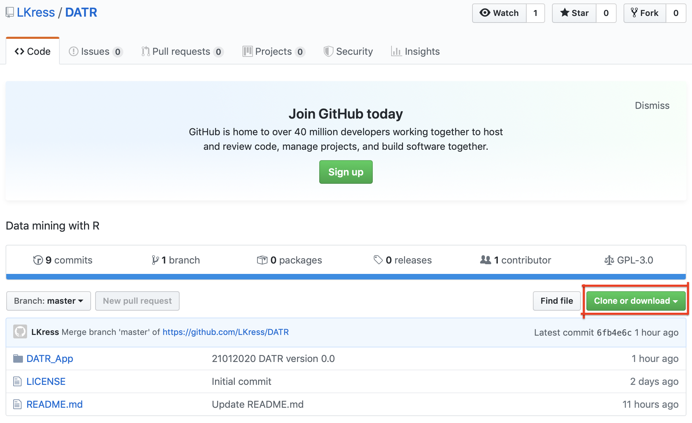
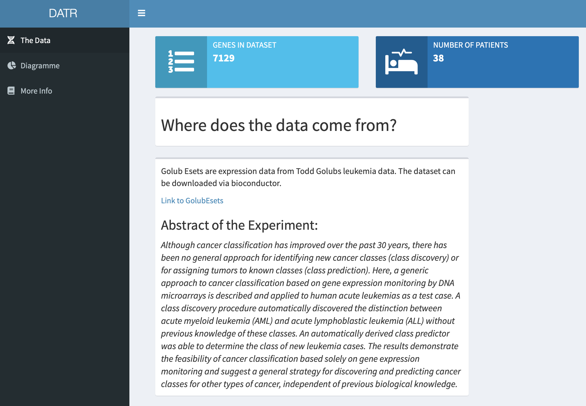
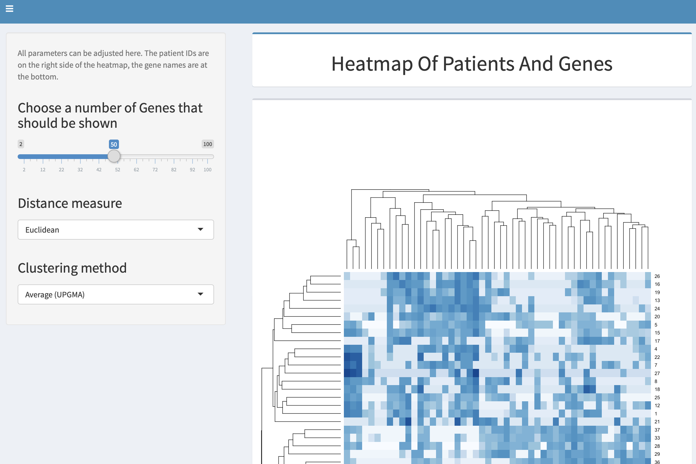
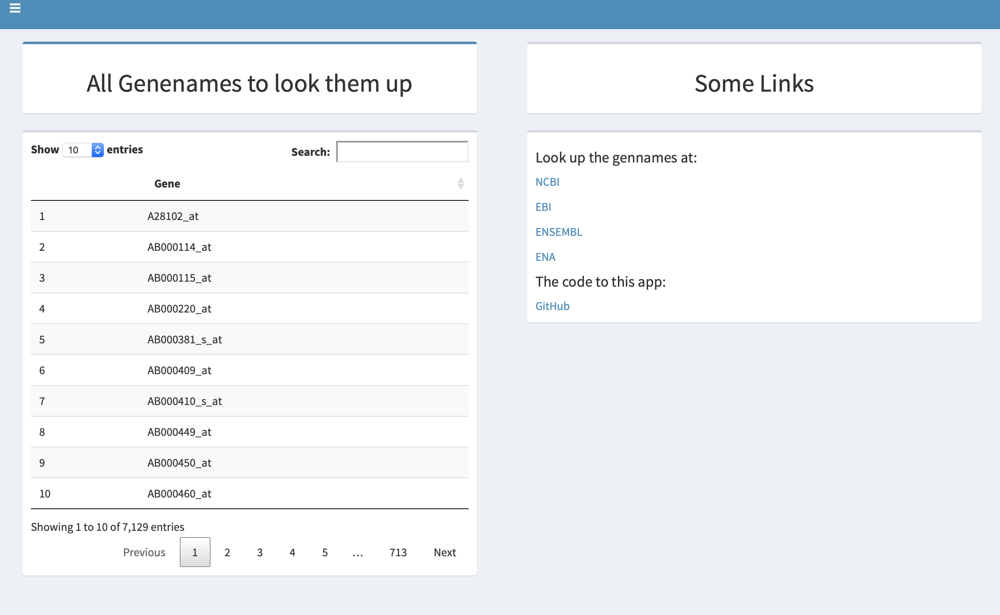

# DATR

### This app will visualize Array Expression Datasets by using the [shiny framework](https://shiny.rstudio.com).

---

### Data mining with R [Test the App here!](https://kress.shinyapps.io/datr/)

---


## Installation

#### There are two ways of useing the DATR app:

##### 1. Useing the online version
Therefore you just need to open [https://kress.shinyapps.io/datr/](https://kress.shinyapps.io/datr/) in your browser.  
The only problem here is that my computing time on the shinyapps.io server is limited to 25 hours per month, so it might happen that this page won't be reachable.

##### 2. Downloading the source code and run the app on a local device
This can be done by clicking on "Clone or download" and than on ["Download ZIP"](https://github.com/LKress/DATR/archive/master.zip).



After downloading the code, you should check if you have all packages installed that are needed to run the app.
The packages are:

[shiny](https://shiny.rstudio.com/tutorial/written-tutorial/lesson1/)

[shinydashboard](https://rstudio.github.io/shinydashboard/get_started.html)

[BiocManager](https://www.bioconductor.org/install/)

[golubEsets](http://bioconductor.org/packages/release/data/experiment/html/golubEsets.html)

[RColorBrewer](https://cran.r-project.org/web/packages/RColorBrewer/index.html)

[DT](https://www.rdocumentation.org/packages/DT/versions/0.11)


Run this code in your R console:

```> is.installed <- function(mypkg) is.element(mypkg, installed.packages()[,1])```

```> is.installed(c("shiny", "shinydashboard", "BiocManager", "golubEsets", "RColorBrewer", "DT"))```

The output should look like this:

```[1] TRUE TRUE TRUE TRUE TRUE```

If it doesn't look like this you should install the corresponding package.
I.e. if the second value isnt TRUE but FALSE you have to install shinydashboard.

If the desired output is reached change to your working directory to the directory where the downloaded source code is.

Then run this code:

```> library(shiny)```

```> runApp("DATR_App")```
 
The output should look like this:

```Listening on http://127.0.0.1:7690```

You can now open the localhost adress in your browser and you will see the app.


## The Data Tab



On the start tab (data tab) you can find some information about the data that is visualized. The two infoboxes are showing the number of genes in the experiment and the number of patients that have been examined.
The abstract of the experiment is shown on the data tab too.

## The Diagram Tab



On the diagram tab you can find one slider, two selection boxes and a heatmap. 
With the slider the number of genes that should be shown in the heatmap can be regulated. In the background the app calculates the genes with the highest expression in the chosen range.

```xHighestEX = xLogarithmised[names(sort(apply(xLogarithmised,1,var), decreasing=TRUE)[1:input$numberOfGenes]),]```

This is the codeblock where the chosen number of genes with the highest expression are calculated.
The default value are 50 genes.

By choosing a distance measure in the first selection box the heatmap will be generated by useing the chosen distance measure. Availeable distance measures are: Euclidean, Maximum, Manhattan, Canberra, Binary and Minkowski.
Further information about the distance measure can be found [here](https://www.rdocumentation.org/packages/stats/versions/3.6.2/topics/dist).

In the second selection box the clustering method can be chosen. This will also change the clustering method of the heatmap. Possible values are: Ward.D, Ward.D2, Single, Complete, Average (= UPGMA), Mcquitty (= WPGMA), Median (= WPGMC) and Centroid (= UPGMC).
Further information about the clustering method can be found [here](https://www.rdocumentation.org/packages/stats/versions/3.6.2/topics/hclust).


## The More Info Tab


The More Info tab shows a table of all genenames that appear in the experiment.
 
Next to the table some links for databases where these genenames can be searched in are shown. The link to this GitHub page is placed there as well.


## About the App

Microarray data is often big and hard to interprete. Thats why it is necessary to preprocess and visualize the data. 
This app should do both in a interactive way. 
The data in this app are from Todd Golub. It is accessible via the bioconductor webpage. In the Golub experiment were 38 patients which were testet on their gene expression of 7129 genes. The 38 patients are either in one of the 2 groups: acute myeloid leukemia (AML) and acute lymphoblastic leukemia (ALL) that are both cancer deseases. Patient 1-27: ALL, Patient 28-38: AML.
With the help of this app these 2 groups should be shown, so that later researchers can find out in which group other patients are.

The problem of microarray data is that some data points have a negative value due to measuring errors.
This app is preprocessing the data by deleting negative numbers in the expression data and it logarithmizes the data so that the differences of the values aren't too high. Else the visualization wouldn't be that good.

The heatmap shows the logarithmized expression value of each patient for each of the genes with a different colored blue rectangle. The darker the blue of the rectangle the higher the value.
At the left of the heatmap a dendrogram shows the connection of the patients. Patients that have closer values are closer together in the dendrogram.

#### Interpretation

With the visualization we will show that there are two groups of patients. So the dendrogram on the left of the heatmap should have two big branches.

If we put the default values in the selection boxes and in the slider we can see that there are 3 branches. That means that there is a third group that havn't been seen in the phenotype. The patients 28-38 are in one branch in the heatmap their expression pattern is almost identical. 
The other group splits up into two new groups with 6,3,23,10,11,9,14,2 and the other group with the rest of the patients.

Where this other group comes from can't be found out. It might be caused by the treatment of the patients, but can also have a totally different reason.

---

A example can be testet live at [https://kress.shinyapps.io/datr/](https://kress.shinyapps.io/datr/).

